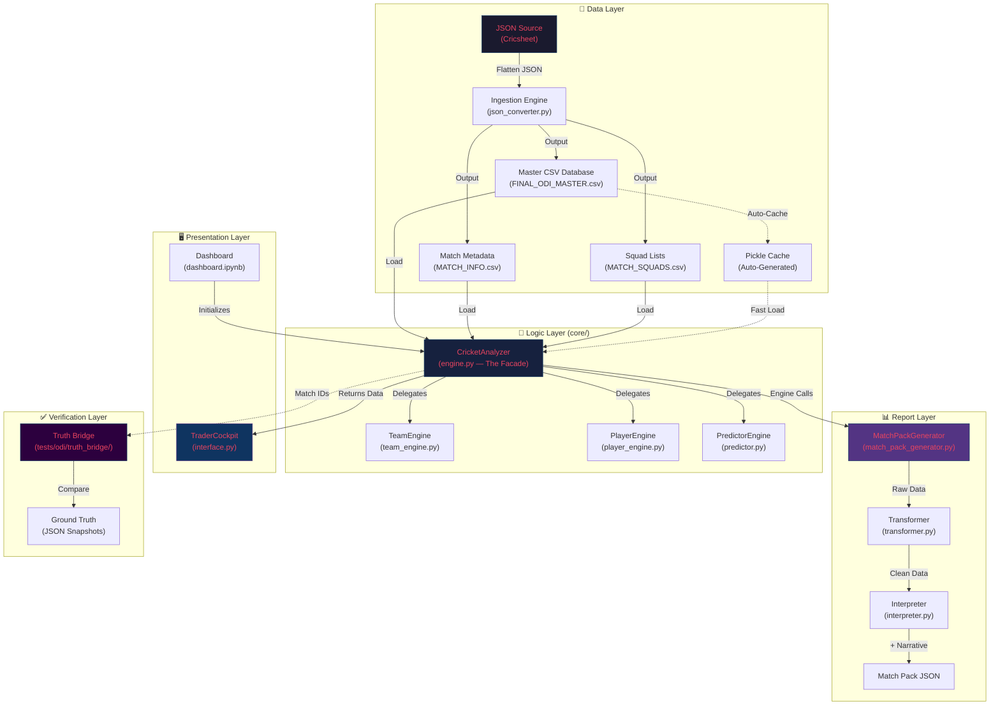
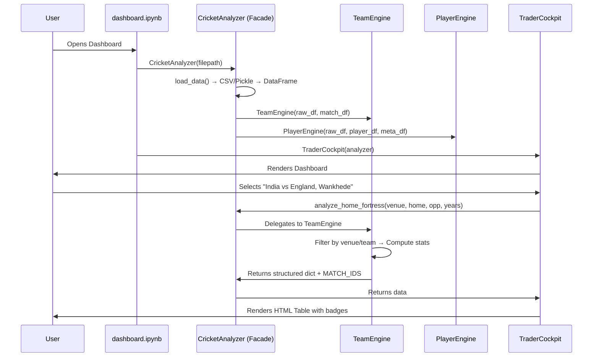
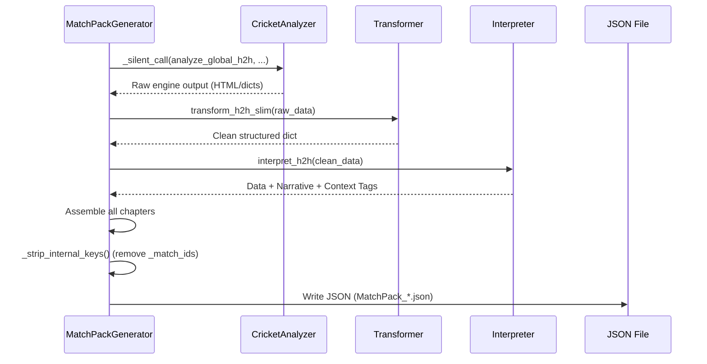

# 🏗️ Cricket Algo-Trader — Application Architecture

## 1. Executive Summary

**Project:** Cricket Algo-Trader ("The Dugout")
**Purpose:** A high-frequency analytics dashboard for professional cricket traders. It bypasses raw averages to uncover contextual edge cases (e.g., "Left-Arm Pace vs Top Order at Wankhede") using granular ball-by-ball data.
**Core Philosophy:** *"Context over Content."* A player's batting average alone is meaningless — it only becomes actionable when filtered by venue, opponent, recent form, and match phase.

---

## 2. High-Level Architecture

The application follows a **4-Layer MVC Hybrid** pattern tailored for Jupyter environments, with an additional Verification Layer for data integrity.



---

## 3. Layer-by-Layer Breakdown

### 3.1 Data Layer (The Foundation)

| File | Role | Key Details |
|:-----|:-----|:------------|
| `data/json_source/*.json` | Raw Source | Cricsheet ball-by-ball JSON files |
| `utils/json_converter.py` | Ingestion Engine | Flattens JSONs → 3 CSVs |
| `data/FINAL_ODI_MASTER.csv` | **Source of Truth** | Every ball bowled (1M+ rows, ~100MB+) |
| `data/MATCH_SQUADS.csv` | Context Data | Playing XI per match (enables DNB detection) |
| `data/MATCH_INFO.csv` | Metadata | Winner, Venue, Toss, Dates |
| `data/player_metadata.csv` | Player Index | Player → Primary Team mapping |
| `config/teams.py` | Static Config | Team colors, bowler styles, player roles |
| `venues.py` | Venue Normalization | `VENUE_MAP` aliases ("M. Chinnaswamy" → "IND_BANGALORE") |

**Data Update Workflow:**
1. Download latest `odis_json.zip` from Cricsheet.org
2. Extract into `data/json_source/`
3. Run `python utils/json_converter.py`
4. Restart dashboard kernel (data loads into memory on startup)

**Performance: Self-Healing Pickle Cache**
On startup, `CricketAnalyzer` checks if a `.pkl` cache is newer than the CSV. If yes → fast-loads from pickle (~80% faster). If no → rebuilds the pickle automatically.

---

### 3.2 Logic Layer — The Brains (`core/`)

#### `engine.py` — The Facade (Controller)

The central orchestrator. Implements the **Facade Pattern** to hide sub-engine complexity from the UI. Loads data once, injects shared DataFrames into sub-engines via **Dependency Injection**.

**Key Responsibilities:**
- Data loading, cleaning, and caching (`load_data`, `reload_database`)
- Match summary aggregation (`_create_match_summary`)
- Venue name standardization (`_smart_standardize_venues`)
- Delegates all analysis to sub-engines via passthrough methods

#### `core/team_engine.py` — Macro Analysis

Handles team-level strategic intelligence.

| Function | Purpose |
|:---------|:--------|
| `analyze_head_to_head` | Win % matrix with breakdown (Bat 1st/2nd wins) |
| `analyze_home_fortress` | Home dominance with Smart Filters (excludes easy chases < 200) |
| `analyze_venue_phases` | Phase-by-phase scoring (PP/Middle/Death, 1st & 2nd innings) |
| `analyze_venue_bias` | Toss impact analysis (Bat 1st vs Field 1st win rates) |
| `analyze_home_dominance` | Home performance matrix vs all opponents |
| `analyze_away_performance` | Away win rates across all host countries |
| `analyze_team_form` | Recent form sequence (last 10 matches) |

#### `core/player_engine.py` — Micro Analysis

Handles player-level granular intelligence.

| Function | Purpose |
|:---------|:--------|
| `compare_squads` | Full XI comparison: experience, form, matchups |
| `analyze_squad_types` | Tactical Matrix: batter avg vs each bowling type |
| `_get_stats` | Per-player: batting/bowling form, venue history, vs opponent |
| `_display_batter_vs_bowlers` | Batter vs specific bowler H2H (bunny detection) |
| `_generate_comparison_payload` | Structured data export for regression tests & reports |
| `analyze_player_profile` | Individual player deep-dive card |

#### `core/predictor.py` — Prediction Engine

Weighted factor model for match outcome prediction. Combines venue bias, form, H2H, and conditions.

---

### 3.3 Presentation Layer — The Face

#### `interface.py` — TraderCockpit

The main UI built with `ipywidgets` + custom HTML/CSS.

**Tabs:**
- **Team Analysis** — H2H, Fortress, Dominance matrices
- **Player Analysis** — Player cards, squad comparison
- **Phase Analysis** — Run rate charts per 10-over phase
- **Venue Analysis** — Toss bias, par scores

**Key Design Rules:**
- No heavy computation in `__init__` (Widget Performance Rule)
- All styling from `config/teams.py` (Source of Truth Rule)
- 4-Tier badge system: Green (Elite) / Teal (Good) / Orange (Average) / Red (Poor)

#### `dashboard.ipynb` — Entry Point

Initializes `CricketAnalyzer` → creates `TraderCockpit` → displays UI.

---

### 3.4 Report Layer — The Combat Manual

The Match Pack pipeline generates AI-consumable JSON reports for pre-match analysis.

```
Engine Call (silent) → Transformer (clean data) → Interpreter (narrative + context) → JSON
```

#### `reports/match_pack_generator.py` — The Orchestrator

Chains engine calls through the transformer and interpreter pipeline. Uses `_silent_call()` to suppress engine stdout/UI output while capturing return values.

**Report Structure (4 Chapters):**
1. **Macro Context** — Global H2H, team form, dominance matrices
2. **Battlefield** — Fortress check, venue H2H, toss bias
3. **Tactical Engine** — Phase analysis, condition weights
4. **Player Intelligence** — Squad comparison, tactical matrix, matchups, player stats, bowling roster

#### `core/transformer.py` — The Data Cleaner

Converts raw engine output (HTML strings, emoji-decorated dicts, flat `[{Metric, Value}]` lists) into clean structured JSON.

| Function | Input → Output |
|:---------|:---------------|
| `transform_h2h_slim` | `[{Metric, Value}]` → wins/losses only (no averages) |
| `transform_h2h_report` | `[{Metric, Value}]` → full H2H with batting averages |
| `transform_venue_bias` | Flat dict → structured toss/decision analysis |
| `transform_team_form` | Form dict → summary stats (no match details) |
| `transform_dominance_matrix` | Matrix rows → aggregated win/loss stats |
| `transform_squad_comparison` | Nested payload → clean squad/matrix/matchup data |
| `transform_player_stats` | `_get_stats` dict → batting/bowling/venue objects |

#### `core/interpreter.py` — The Intelligence Layer

Adds narrative context, trend detection, and contextual tags to transformed data.

| Function | What It Adds |
|:---------|:-------------|
| `interpret_h2h` | Dominance narrative, trend analysis, context tags |
| `interpret_form` | Momentum assessment, win quality, trend reasoning |
| `interpret_fortress` | Fortress strength rating (0-100) |
| `interpret_toss_bias` | Toss decision alignment with match context |
| `interpret_dominance` | Home/Away strength classification |
| `interpret_conditions` | Pitch/Time/Toss condition weights |
| `analyze_bowling_roster` | Bowling composition vs pitch suitability |
| `generate_executive_summary` | Cross-chapter tactical summary |

---

### 3.5 Verification Layer — Truth Bridge

A non-destructive verification system that auto-diagnoses test failures.

**Core Workflow:**
1. **SEED**: Capture baseline engine outputs as JSON snapshots
2. **REFACTOR**: Make code changes
3. **VALIDATE**: Compare current output vs baseline
   - **PASS** — Output matches exactly
   - **DATA_DRIFT** — Results changed because new matches were added (expected)
   - **LOGIC_REGRESSION** — Results changed despite identical Match IDs (critical bug)

**Auto-Diagnosis:** Every engine function returns `MATCH_IDS` in its payload. The Truth Bridge compares file modification timestamps and match ID sets to distinguish drift from regression.

**Suites:**

| Suite | Coverage |
|:------|:---------|
| `analyze_venue_matchup` | Toss bias, ground par stats (240 benchmarks) |
| `check_fortress` | Home dominance, smart chasing filters |
| `compare_squads` | Batter vs bowler tactical parity |
| `global_performance` | Team win/loss metrics |
| `recent_form` | Sequence-based form for 9 teams across 6 continents |
| `analyze_phases` | Phase scoring patterns (~500 permutations) |

---

## 4. Directory Structure

```text
/
├── dashboard.ipynb              # ENTRY POINT
├── engine.py                    # Facade (Controller)
├── interface.py                 # UI (TraderCockpit)
├── venues.py                    # Venue Normalization (VENUE_MAP)
├── settings.py                  # Global Settings
│
├── config/
│   └── teams.py                 # Colors, Roles, Squads (Source of Truth)
│
├── core/
│   ├── player_engine.py         # Micro-Stats (Player vs Player)
│   ├── team_engine.py           # Macro-Stats (Phases, Fortresses)
│   ├── predictor.py             # Prediction Model
│   ├── transformer.py           # Data Cleaner (Engine → JSON)
│   └── interpreter.py           # Intelligence Layer (Narrative + Tags)
│
├── reports/
│   └── match_pack_generator.py  # Combat Manual Orchestrator
│
├── data/
│   ├── FINAL_ODI_MASTER.csv     # Source of Truth (1M+ rows)
│   ├── MATCH_SQUADS.csv         # Playing XI per match
│   ├── MATCH_INFO.csv           # Match metadata
│   └── json_source/             # Raw Cricsheet JSONs
│
├── utils/
│   ├── json_converter.py        # ETL: JSON → CSV
│   └── refinery_script.py       # Advanced metric computation
│
├── tests/
│   └── odi/
│       └── truth_bridge/        # Auto-Diagnostic Verification
│           ├── analyze_venue_matchup/
│           ├── check_fortress/
│           ├── compare_squads/
│           ├── analyze_phases/
│           └── recent_form/
│
├── scripts/
│   ├── find_missing_players.py  # Config audit tool
│   └── check_bowler_coverage.py # Bowler mapping audit
│
└── docs/
    └── bug_fixes/               # Post-mortem reports
```

---

## 5. Key Design Patterns

| Pattern | Where | Why |
|:--------|:------|:----|
| **Facade** | `engine.py` → `CricketAnalyzer` | Hides sub-engine complexity from UI |
| **Dependency Injection** | `engine.py` creates `raw_df` once → injects into sub-engines | Single DataFrame in memory |
| **Silent Call** | `match_pack_generator.py` → `_silent_call()` | Engine methods print HTML for UI; generator captures only return values |
| **Self-Healing Cache** | `engine.py` → Pickle auto-rebuild | ~80% faster startup when data hasn't changed |
| **Defensive Coding** | All engines | NaN-safe math (`avg = runs / outs if outs > 0 else runs`) |
| **Source of Truth** | `config/teams.py` | All colors, roles, styles centralized — never hardcoded |
| **Truth Bridge** | `tests/odi/truth_bridge/` | Auto-diagnoses DATA_DRIFT vs LOGIC_REGRESSION |

---

## 6. Data Flow Diagram



---

## 7. Match Pack Pipeline


