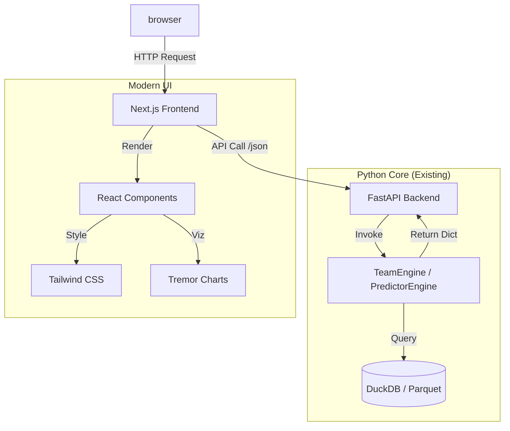

# 🚀 Next-Gen Architecture: The "Modern Web Stack"

## 🎯 Goal: Premium, Efficient, User-Friendly UI
Move from Jupyter Widgets (fragile, slow) to a **Production-Grade Web Application**.

> **Status (2026-02-15):** Backend engines are 100% headless and API-ready. Format Registry v2.0 supports dynamic format loading. The Facade (`engine.py` v3.0) accepts `format_type` parameter. **Ready to build the API layer.**

---

## 🏗️ 1. The Stack Selection

### 🧠 Backend: [FastAPI (Python)](https://fastapi.tiangolo.com/)
*   **Why:** You already have the `Headless Engines` (Python Dictionary outputs). FastAPI wraps them instantly.
*   **Speed:** Asynchronous, high-performance (Starlette + Pydantic).
*   **Documentation:** Automatic Swagger/OpenAPI docs for your Engine endpoints.
*   **Type Safety:** Uses Pydantic models (which we started adopting) for request validation.

### 🎨 Frontend: [Next.js (React Framework)](https://nextjs.org/)
*   **Why:** The Industry Standard for modern web apps. extremely fast (Server Components), great SEO (if public), massive ecosystem.
*   **State Management:** React handles complex state (filters, toggles) instantly without re-running backend logic (unlike Streamlit).

### 💅 UI Components: [Shadcn/UI + Tailwind CSS](https://ui.shadcn.com/)
*   **Why:** "Excellent modern application" aesthetic out of the box.
*   **Philosophy:** Not a component library you install, but code you copy-paste. You own the components.
*   **Features:**
    *   **Data Table:** Powerful sorting/filtering/pagination for Player Stats.
    *   **Combobox:** Searchable dropdowns for Players/Stadiums (like existing Jupyter widgets but faster).
    *   **Cards:** Beautiful container components for Dashboard layout.
    *   **Dark Mode:** Built-in first-class support.

### 📊 Visualization: [Recharts](https://recharts.org/) or [Tremor](https://www.tremor.so/)
*   **Why:** Tremor is designed specifically for **Dashboards**. It looks professional immediately.
    *   *Donut Charts* for Win Probability.
    *   *Bar Lists* for Top Run Scorers.
    *   *Area Charts* for momentum/worm graphs.

---

## 🔄 2. Architecture Diagram

---

## 🛠️ 3. Implementation Phases

### Phase 1: The API Layer (Backend)
1.  **Dependencies:** `fastapi`, `uvicorn`, `pydantic` (already in `requirements.txt`, commented).
2.  **Pre-requisites (DONE):**
    *   ✅ Headless engines return pure data dicts (no HTML).
    *   ✅ Format Registry v2.0 (`get_format_engines()`) for dynamic loading.
    *   ✅ `CricketAnalyzer(format_type="odi")` works.
3.  **Tasks:**
    *   Create `api/main.py`.
    *   Wrap `PredictorEngine.predict_score` in a POST endpoint `/api/{format}/predict`.
    *   Wrap `TeamEngine.analyze_venue_bias` in a GET endpoint `/api/{format}/venue/{id}`.
    *   Define Pydantic Models for Input/Output (leverage existing type hints).

### Phase 2: The Shell (Frontend Setup)
1.  **Setup:** `npx create-next-app@latest cricket-analyst-ui`.
2.  **Styling:** Install Tailwind CSS & Shadcn/UI.
3.  **Layout:** Create a Sidebar Layout (Dashboard style).

### Phase 3: The Dashboard Components
1.  **Team Selector:** Using `Select` and `Combobox` components.
2.  **Stat Cards:** Display "Projected Score", "Win Probability" using `Card` components.
3.  **Charts:** Implement `Tremor` AreaChart for Partnership/Worm graphs.

---

## 💡 Why Not Streamlit?
*   **Streamlit:** Great for prototyping, but:
    *   Re-runs entire script on every checkbox click (Performance hit).
    *   Hard to customize layout (Pixel-perfect design is difficult).
    *   Feels like a "Scientific Tool", not a "Premium App".
*   **Next.js + FastAPI:**
    *   **Instant Interactions:** Toggle filters without API calls.
    *   **Animation:** Smooth transitions (Framer Motion).
    *   **Scalability:** Ready for Mobile, Public Release, or Cloud Deployment.

## ✅ Recommendation
Go with **FastAPI + Next.js + Shadcn/UI**. This gives you the "Google/Netflix" quality feel you requested.
