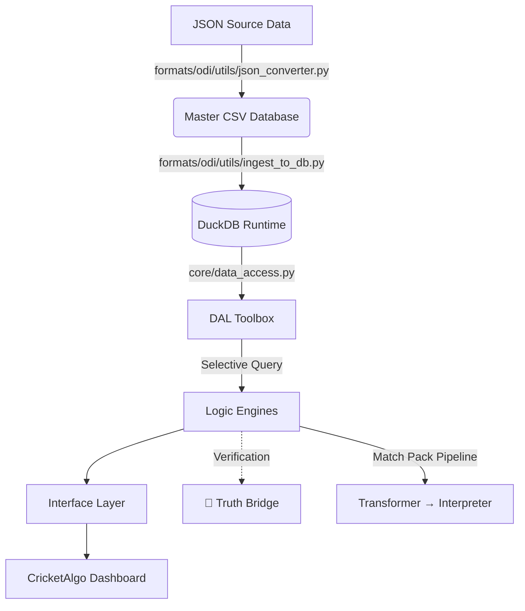

# 📘 The Dugout - Technical Documentation

## 1. 🏗️ High-Level Architecture
**The Dugout** is a high-performance cricket analytics dashboard designed for pro-traders and analysts. It operates on a **Local-First** architecture to ensure zero latency and full data sovereignty.

### System Data Flow

---

## 2. 💻 Tech Stack

### High-Level (User Facing)
*   **Platform:** Python 3.10+
*   **Environment:** Jupyter Notebook / Voila (for standalone web-app feel)
*   **Interface:** `ipywidgets` (Interactive Controls) + `HTML/CSS` (Custom Reporting Tables)

### Low-Level (Core Processing)
*   **Database:** `DuckDB` (Primary runtime query engine - Pure DB Mode)
*   **Data Processing:** `pandas` (Vectorized aggregation of SQL results)
*   **Data Access:** `core/data_access.py` (Centralized DAL)
*   **Verification:** `Truth Bridge` (Snapshot regression testing)

---

## 3. 🚀 Usage Guide

### A. Running the Dashboard
1.  **Launch Jupyter:** `jupyter notebook`
2.  **Open App:** Navigate to `dashboard.ipynb`
3.  **Run All:** Click "Cell" -> "Run All"
4.  **Voila Mode (Optional):** Click the "Voila" button for a clean, code-free UI.

### B. Updating Data
When new match logs (JSON) arrive:
1.  Place `.json` files in `formats/odi/data/json_source/`.
2.  Run the pipeline: `python formats/odi/utils/json_converter.py`.
3.  **Audit Configuration**: Run `python formats/odi/scripts/find_missing_players.py` to ensure new players are mapped in `formats/odi/config/players.py`.
4.  Restart the dashboard kernel.

### C. Quality Control (Truth Bridge)
Before trusting engine results after a code change:
1.  Navigate to `formats/odi/tests/truth_bridge/`.
2.  Run a specific validator, e.g., `python formats/odi/tests/truth_bridge/analyze_venue_matchup/test_runner.py`.
3.  Verify the `report.json` shows `PASS` (or `DATA_DRIFT` for fresh data).

---

## 4. 📂 Codebase Reference (File-by-File)

### 🧱 Core Architecture

#### `engine.py`
**Role:** The Facade v3.0 / Format-Aware Orchestrator.
*   **`CricketAnalyzer`**: The central controller.
    *   **Two Init Modes:**
        *   Legacy: `CricketAnalyzer("formats/odi/data/FINAL_ODI_MASTER.csv")` (auto-detects format)
        *   Modern: `CricketAnalyzer(format_type="odi")` (explicit format)
    *   Uses `config.format_registry.get_format_engines()` for dynamic engine loading.
    *   Uses `core.data_loader.load_csv_or_pickle()` for DRY data caching.
    *   All logging via `logging` module (zero `print()` statements).
    *   `load_data()`: Hot Reload — rebuilds all sub-engines from data.

#### `interface.py`
**Role:** The "Frontend" / View Layer.
*   **`TraderCockpit`**: The main UI class.
    *   `__init__`: Sets up the widget layout (Header, Control Panel, Output Area).
    *   `_setup_tabs()`: Creates the "Team Analysis", "Player Analysis", and "Phase Analysis" tabs.
    *   `on_generate_click()`: The Event Handler. Collects inputs → Calls Engine → Updates Output.

### 🧠 Logic Engines (`core/`)

**Note:** `core/*.py` files are now **factories** that dynamically load format-specific implementations via `config/format_registry.py`. The actual engine logic lives in `formats/{fmt}/engines/`.

#### `core/player_engine.py` → Factory
*   `get_player_engine("odi")` loads `formats.odi.engines.player_engine.PlayerEngine`.
*   Direct `from core.player_engine import PlayerEngine` still works (defaults to ODI).

The ODI implementation (`formats/odi/engines/player_engine.py`):
    *   `analyze_player_profile()`: Master orchestration for the Player Card.
    *   `analyze_squad_types()`: **[TACTICAL]** Generates the "Threat Matrix" (Batter vs. Opposition Bowling Types). v3.3: Includes `Role` metadata per player.
    *   `_get_stats()`: Context-aware stats (DNB logic via `MATCH_SQUADS.csv`).
    *   `_calculate_squad_metrics()`: Aggregated team stats (Caps, Runs, Wickets).

#### `core/team_engine.py` → Factory
*   `get_team_engine("odi")` loads `formats.odi.engines.team_engine.TeamEngine`.

The ODI implementation (`formats/odi/engines/team_engine.py`):
    *   `analyze_head_to_head()`: Win % Matrix and recent history. v3.3: Win % excludes Ties/NR from denominator.
    *   `analyze_home_fortress()`: **[SMART FILTER]** Calculates home dominance.
    *   `analyze_team_form()`: Returns opponent-aware form sequences (e.g., `"W: against India"`).
    *   `analyze_continent_performance()`: Regional dominance analysis.

#### `core/transformer.py` (The Data Cleaner)
*   **Purpose:** Receives raw dicts from `TeamEngine`/`PlayerEngine` and produces clean, typed data structures.
*   **Key Functions:**
    *   `transform_h2h_report()` / `transform_h2h_slim()`: Parses H2H metric lists.
    *   `transform_team_form()`: Extracts W/L/T/NR codes from opponent-aware form sequences.
    *   `transform_dominance_matrix()`: Builds per-opponent win records. v3.3: Professional Win % (excludes Ties/NR).
    *   `transform_player_stats()`: Normalizes batting/bowling/venue metrics.

#### `core/interpreter.py` (The Intelligence Layer)
*   **Purpose:** Adds context tags, narratives, and condition weights to clean data.
*   **Key Methods:**
    *   `interpret_h2h()`: Dominance tags (`HOME_DOMINANT`, `COMPETITIVE`, `EVENLY_MATCHED`).
    *   `interpret_form()`: **v3.3 Rank-Weighted Momentum** using `ODI_RANKINGS`. Wins vs Top 3 teams are "Giant Killers" (+2.5), losses to associates are "Momentum Killers" (-2.5).
    *   `interpret_fortress()`: Fortress status (`FORTRESS_CONFIRMED`, `NEUTRAL_GROUND`).
    *   `interpret_toss_bias()`: Toss alignment with venue bias.
    *   `interpret_conditions()`: Pitch/Time/Toss condition adjustments.
    *   `analyze_bowling_roster()`: v3.3: Experience-weighted pitch suitability.
    *   `generate_executive_summary()`: Synthesizes all chapters into a TL;DR prediction.

### 🛠️ Utilities (`utils/`)

#### `formats/odi/utils/json_converter.py`
**Role:** The "Ingestion Engine".
*   **`process_matches()`**:
    1.  Reads raw JSONs.
    2.  Extracts Squads -> `MATCH_SQUADS.csv`.
    3.  Extracts Info -> `MATCH_INFO.csv`.
    4.  Flattens Ball-by-Ball -> `FINAL_ODI_MASTER.csv`.

#### `formats/odi/utils/refinery_script.py`
*   *Note: Runs the ODI-specific refinement pipeline.*

### 💾 Data Layer (`formats/odi/data/`)
*   **`FINAL_ODI_MASTER.csv`**: Every ball bowled (1M+ rows). Source of truth for stats.
*   **`MATCH_SQUADS.csv`**: Who was in the Playing XI (Critical for DNB logic).
*   **`MATCH_INFO.csv`**: Meta-data (Winner, Venue, Dates) for fast lookups.
*   **`player_metadata.csv`**: Unique list of players mapped to their primary teams.
*   **`odi.duckdb`**: Runtime database (preferred). Tables: `balls`, `matches`, `player_stats`, `phase_stats`, `player_metadata`, `squads`. CSVs remain the source artifacts; `ingest_to_db.py` rebuilds the DB.

### 💾 Tactical Configuration (`config/` and `formats/odi/config/`)
*   **`config/shared/team_colors.py`**: Team color palette (`TEAM_COLORS`).
*   **`config/shared/venues.py`**: Venue normalization map (`VENUE_MAP`) and helpers.
*   **`formats/odi/config/players.py`**: ODI-specific `BOWLER_STYLES` and `PLAYER_ROLES`.
*   **`formats/odi/config/rankings.py`**: ODI rankings (`ODI_RANKINGS`) used for rank-weighted momentum analysis.
    *   **10-Year Coverage**: All international players since 2014 are mapped.
    *   **Historical Legends**: 200+ pre-2014 legends mapped to support career-long tactical visibility.
    *   **Maintenance**: Guided by `find_missing_players.py` and `check_bowler_coverage.py`.

### 📊 Match Pack Reports (`formats/odi/reports/`)
*   **`formats/odi/match_pack.py`**: The Combat Manual orchestrator.
    *   **4-Chapter Structure**: Macro Context → Battlefield → Tactical Engine → Player Intelligence.
    *   **v3.3 Enhancements**: Battlefield Timeline, Role-Based Tactical Narratives, Granular Player Stats.
    *   **Output**: JSON reports saved to `formats/odi/reports/MatchPack_<Team1>_vs_<Team2>_<timestamp>.json`.

---

## 5. ⚡ Performance & Caching (The Fast-Load Path)

To handle 1M+ rows efficiently, the engine implements a **Self-Healing Pickle Cache**:

1.  **Detection**: On startup, `CricketAnalyzer` checks for a `.pkl` file matching the database name (e.g., `FINAL_ODI_MASTER.pkl`).
2.  **Validation**: It compares the `mtime` (modified time) of the CSV vs. the Pickle.
3.  **The Fast Path**: If the Pickle is newer, it loads via `pd.read_pickle()` (**~80% faster** than CSV).
4.  **The Slow Path (Auto-Rebuild)**: If the CSV is newer (user updated the data), the engine performs a "Slow Load", cleans the data, and **automatically regenerates** the Pickle file for the next session.

---

## 6. 🧩 Key Design Patterns
1.  **Factory Pattern:** `core/*.py` files are factories that dynamically load format-specific engines via `config/format_registry.py`.
2.  **Dependency Injection:** `engine.py` creates `raw_df` once and injects into sub-engines. Efficient memory usage.
3.  **Facade Pattern:** `CricketAnalyzer` hides the complexity of sub-engines from the UI.
4.  **Defensive Coding:** "NaN-Safe" math via `core/base_engine.py` (`_safe_divide()`, `_safe_float()`).
5.  **3-Stage Pipeline (Match Pack):** Raw Engine Data → `Transformer` (clean) → `Interpreter` (contextualize) → `Generator` (orchestrate).
6.  **Rank-Weighted Analysis:** `ODI_RANKINGS` drives quality-aware momentum scoring.
7.  **Format Registry:** `config/format_registry.py` v2.0 — central hub for engines, manifests, and configs per format.
8.  **Self-Healing Cache:** `core/data_loader.py` auto-rebuilds pickle when CSV is newer.
