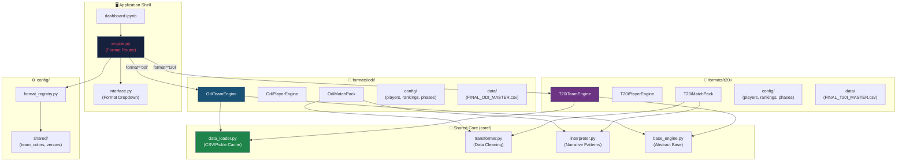
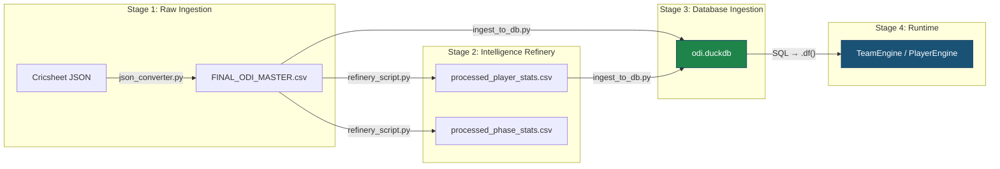

# 🏗️ Modularization Implementation Plan — Multi-Format Plugin Architecture

**Status:** Approved  
**Created:** 2026-02-13  
**Author:** AI Agent (Gemini)  
**Scope:** Restructure the Cricket Algo-Trader from a single-format ODI application into a modular, plugin-based system supporting ODI, T20I, Women's ODI/T20I, and franchise leagues (IPL, BBL, PSL).

---

## 1. Executive Summary

### The Problem
The current application is a single-format ODI system. Every engine, config, test suite, and data pipeline is tightly coupled to the ODI format. Expanding to T20I or Women's cricket would require either:
- **(A) Forking** — Creating separate apps per format (causes code drift and 5x maintenance).
- **(B) Monolith** — Forcing all formats into the same engine functions (impossible: T20I analysis differs from ODI).

### The Solution
A **Modular Plugin Architecture** — one application shell with format-specific modules that each define their own engines, configs, data pipelines, and tests. Shared infrastructure (data loading, UI shell, venue maps) lives in `core/`.

### Key Principle
> *"Each format module can define completely different analysis functions. T20I doesn't need to mirror ODI's API — it can have unique features like 'Impact Player Analysis' or 'Death Over Specialist Scoring' that don't exist in ODI."*

---

## 2. Target Architecture

### 2.1 Directory Structure

```text
Cricket_Project_Stable/                    # Single Application Root
│
├── engine.py                              # FORMAT ROUTER (loads the right module)
├── interface.py                           # UI SHELL (format dropdown → loads module UI)
├── dashboard.ipynb                        # ENTRY POINT
│
├── core/                                  # ═══ SHARED INFRASTRUCTURE ═══
│   ├── __init__.py
│   ├── base_engine.py                     # [NEW] Abstract base classes for engines
│   ├── data_loader.py                     # [NEW] Generic CSV/Pickle loading + caching
│   ├── transformer.py                     # Shared data cleaning utilities
│   └── interpreter.py                     # Shared narrative generation patterns
│
├── config/                                # ═══ CONFIGURATION ═══
│   ├── __init__.py                        # Config router: load_config(format_type)
│   ├── format_registry.py                 # [NEW] Format module registry
│   ├── shared/                            # Shared across ALL formats
│   │   ├── __init__.py
│   │   ├── team_colors.py                 # TEAM_COLORS dict
│   │   └── venues.py                      # VENUE_MAP dict
│   └── teams.py                           # [SHIM] Backward-compatible re-exports
│
├── formats/                               # ═══ FORMAT-SPECIFIC MODULES ═══
│   ├── __init__.py
│   │
│   ├── odi/                               # ← CURRENT APP MOVES HERE
│   │   ├── __init__.py                    # Exports: TeamEngine, PlayerEngine, CONFIG
│   │   ├── team_engine.py                 # ODI-specific team analysis functions
│   │   ├── player_engine.py               # ODI-specific player analysis functions
│   │   ├── predictor.py                   # ODI prediction model
│   │   ├── match_pack.py                  # ODI Match Pack generator
│   │   ├── config/
│   │   │   ├── __init__.py
│   │   │   ├── players.py                 # BOWLER_STYLES, PLAYER_ROLES (ODI)
│   │   │   ├── rankings.py                # ODI_RANKINGS
│   │   │   └── settings.py                # ODI phases, par scores, thresholds
│   │   ├── data/                          # ODI datasets
│   │   │   ├── FINAL_ODI_MASTER.csv
│   │   │   ├── MATCH_SQUADS.csv
│   │   │   ├── MATCH_INFO.csv
│   │   │   ├── processed_player_stats.csv
│   │   │   └── player_metadata.csv
│   │   ├── utils/
│   │   │   ├── json_converter.py          # ODI-specific ingestion pipeline
│   │   │   └── refinery_script.py         # ODI-specific refinery
│   │   └── tests/                         # ODI-specific test suites
│   │       ├── run_v31_tests.py
│   │       ├── truth_bridge/
│   │       └── regression_suite/
│   │
│   ├── t20i/                              # [FUTURE] T20I Men's
│   │   ├── __init__.py
│   │   ├── team_engine.py                 # T20I-specific functions
│   │   ├── player_engine.py               # Death over specialists, impact players
│   │   ├── match_pack.py                  # T20I Match Pack (different chapters)
│   │   ├── config/
│   │   │   ├── players.py                 # T20I player maps
│   │   │   ├── rankings.py                # T20I_RANKINGS
│   │   │   └── settings.py                # PP=1-6, Mid=7-15, Death=16-20
│   │   ├── data/
│   │   ├── utils/
│   │   └── tests/
│   │
│   ├── wodi/                              # [FUTURE] Women's ODI
│   │   ├── __init__.py
│   │   ├── team_engine.py
│   │   ├── player_engine.py
│   │   ├── config/
│   │   ├── data/
│   │   └── tests/
│   │
│   ├── wt20i/                             # [FUTURE] Women's T20I
│   │   └── ...
│   │
│   └── ipl/                               # [FUTURE] IPL (Franchise Logic)
│       ├── __init__.py
│       ├── team_engine.py                 # Franchise-specific (auction, squads, seasons)
│       ├── player_engine.py               # Impact player, retained player analysis
│       ├── config/
│       │   ├── franchises.py              # Franchise colors, owners, home grounds
│       │   └── settings.py                # IPL-specific rules (Impact Player, etc.)
│       ├── data/
│       └── tests/
│
├── venues.py                              # [SHIM] Backward-compatible re-export
├── scripts/                               # Shared maintenance scripts
│   ├── find_missing_players.py
│   └── check_bowler_coverage.py
│
└── docs/
    ├── docs/plans/modularization_implementation_plan.md   # THIS DOCUMENT
    └── bug_fixes/
```

---

### 2.2 Architectural Diagram



---

### 2.3 What's Shared vs. What's Module-Specific

| Component | Shared (`core/` or `config/shared/`) | Module-Specific (`formats/<fmt>/`) |
|:----------|:-------------------------------------|:-----------------------------------|
| Data Loading (CSV/Pickle/Cache) | ✅ Generic loader | File paths defined per module |
| Venue Map (`VENUE_MAP`) | ✅ Same stadiums for all formats | — |
| Team Colors (`TEAM_COLORS`) | ✅ India Blue is always India Blue | Franchise colors in `ipl/config/` |
| Player Configs (Roles, Styles) | ❌ | ✅ Different rosters per format |
| Rankings | ❌ | ✅ ODI vs T20I rankings differ |
| Phase Definitions (PP/Mid/Death) | ❌ | ✅ ODI: 10/40/50 vs T20I: 6/15/20 |
| Team Engine Functions | Optional shared base class | ✅ Each format defines its own |
| Player Engine Functions | Optional shared base class | ✅ Each format defines its own |
| Transformer Utilities | ✅ `_strip_emojis`, `_safe_int`, etc. | Can extend with format-specific parsers |
| Interpreter Patterns | ✅ Dominance tags, momentum scoring | Can extend with format-specific narratives |
| Match Pack Generator | ❌ | ✅ Different chapters per format |
| Predictor Model | ❌ | ✅ Different weights/models per format |
| Test Suites | ❌ | ✅ Isolated per format |
| JSON Converter (Ingestion) | ❌ | ✅ Different source dirs per format |
| Refinery (Phase Stats) | ❌ | ✅ Phase boundaries differ per format |

---

## 3. Implementation Phases

### Phase 1: Create the Directory Structure (Zero Functional Changes)

**Goal:** Set up the `formats/odi/`, `config/shared/`, and `core/` directories. Copy files to new locations. Create backward-compatible shims so **all existing imports still work**.

#### Step 1.1 — Create Shared Config
| Action | Source | Destination |
|:-------|:-------|:------------|
| Extract | `TEAM_COLORS` from `config/teams.py` | `config/shared/team_colors.py` |
| Extract | `VENUE_MAP` from `venues.py` | `config/shared/venues.py` |
| Create | — | `config/shared/__init__.py` |

#### Step 1.2 — Create ODI Config Module
| Action | Source | Destination |
|:-------|:-------|:------------|
| Extract | `BOWLER_STYLES`, `PLAYER_ROLES`, style constants from `config/teams.py` | `formats/odi/config/players.py` |
| Extract | `ODI_RANKINGS` from `config/teams.py` | `formats/odi/config/rankings.py` |
| Create | Phase definitions, par scores | `formats/odi/config/settings.py` |

#### Step 1.3 — Create Backward-Compatible Shims

**`config/teams.py`** (shim):
```python
"""
BACKWARD COMPATIBILITY SHIM
All new code should import from config/shared/ or formats/odi/config/.
This file re-exports everything so existing imports don't break.
"""
from config.shared.team_colors import TEAM_COLORS
from formats.odi.config.players import BOWLER_STYLES, PLAYER_ROLES, STYLE_RIGHT_PACE, STYLE_LEFT_PACE, STYLE_OFF_SPIN, STYLE_LEFT_SPIN, STYLE_WRIST_SPIN
from formats.odi.config.rankings import ODI_RANKINGS
```

**`venues.py`** (shim):
```python
"""BACKWARD COMPATIBILITY SHIM"""
from config.shared.venues import VENUE_MAP, get_venue_aliases
```

#### Step 1.4 — Create Core Shared Utilities

| Action | File | Purpose |
|:-------|:-----|:--------|
| Create | `core/data_loader.py` | Extract CSV/Pickle loading logic from `engine.py.load_data()` into a reusable function |
| Create | `core/base_engine.py` | Abstract base class with shared utility methods (`_safe_int`, `_get_avg_with_count`) |
| Keep | `core/transformer.py` | Already shared — no changes needed |
| Keep | `core/interpreter.py` | Already shared — update import to accept rankings as parameter  |

**`core/data_loader.py`:**
```python
import pandas as pd
import os

def load_csv_or_pickle(csv_path):
    """
    Self-Healing Pickle Cache.
    Loads from pickle if cache is newer than CSV, otherwise rebuilds.
    """
    pkl_path = csv_path.replace('.csv', '.pkl')
    use_cache = False
    
    if os.path.exists(pkl_path):
        csv_mtime = os.path.getmtime(csv_path)
        pkl_mtime = os.path.getmtime(pkl_path)
        if pkl_mtime > csv_mtime:
            use_cache = True
    
    if use_cache:
        print(f"🚀 FAST LOAD: {pkl_path}")
        return pd.read_pickle(pkl_path)
    else:
        print(f"⏳ SLOW LOAD: {csv_path}")
        df = pd.read_csv(csv_path, low_memory=False)
        df.columns = df.columns.str.strip().str.lower()
        if 'start_date' in df.columns:
            df['start_date'] = pd.to_datetime(df['start_date'], errors='coerce')
            df['year'] = df['start_date'].dt.year
        df.to_pickle(pkl_path)
        return df
```

#### Verification Checkpoint
- [ ] All existing imports resolve (no `ImportError`)
- [ ] All 46 tests pass (`tests/run_v31_tests.py`)
- [ ] Dashboard launches and functions identically

---

### Phase 2: Create the Format Registry & Router

#### Step 2.1 — Format Registry

**`config/format_registry.py`:**
```python
"""
FORMAT REGISTRY
Maps format_type strings to their module paths.
Adding a new format = Adding one line here + creating the module.
"""
import importlib

FORMATS = {
    "odi":   {"module": "formats.odi",   "label": "Men's ODI"},
    "t20i":  {"module": "formats.t20i",  "label": "Men's T20I"},
    "wodi":  {"module": "formats.wodi",  "label": "Women's ODI"},
    "wt20i": {"module": "formats.wt20i", "label": "Women's T20I"},
    "ipl":   {"module": "formats.ipl",   "label": "IPL"},
}

def get_format_module(format_type):
    """Dynamically imports and returns the format module."""
    entry = FORMATS.get(format_type)
    if not entry:
        raise KeyError(f"Unknown format: '{format_type}'. Available: {list(FORMATS.keys())}")
    return importlib.import_module(entry["module"])

def get_available_formats():
    """Returns list of (label, key) tuples for UI dropdowns."""
    return [(v["label"], k) for k, v in FORMATS.items()]
```

#### Step 2.2 — Format Module Interface

Every format module's `__init__.py` must export a standard interface:

**`formats/odi/__init__.py`:**
```python
"""
ODI Format Module
Exports the standard interface that engine.py expects.
"""
from .team_engine import TeamEngine
from .player_engine import PlayerEngine
from .predictor import PredictorEngine
from .config.settings import ODI_FORMAT_CONFIG as FORMAT_CONFIG
```

**`formats/odi/config/settings.py`:**
```python
"""ODI-specific configuration constants."""

ODI_FORMAT_CONFIG = {
    "label": "Men's ODI",
    "data_file": "formats/odi/data/FINAL_ODI_MASTER.csv",
    "squads_file": "formats/odi/data/MATCH_SQUADS.csv",
    "info_file": "formats/odi/data/MATCH_INFO.csv",
    "player_stats_file": "formats/odi/data/processed_player_stats.csv",
    "metadata_file": "formats/odi/data/player_metadata.csv",
    "phase_stats_file": "formats/odi/data/processed_phase_stats.csv",
    "json_source_dir": "formats/odi/data/json_source",
    "phases": {
        "pp": {"start": 0, "end": 9, "label": "Powerplay (1-10)"},
        "mid": {"start": 10, "end": 39, "label": "Middle (11-40)"},
        "dth": {"start": 40, "end": 49, "label": "Death (41-50)"},
    },
    "total_overs": 50,
}
```

#### Step 2.3 — Update `engine.py` (Format Router)

```python
from config.format_registry import get_format_module
from core.data_loader import load_csv_or_pickle

class CricketAnalyzer:
    def __init__(self, format_type="odi"):
        self.format_type = format_type
        self.module = get_format_module(format_type)
        self.format_config = self.module.FORMAT_CONFIG
        print(f"⚙️ Initializing {self.format_config['label']} Engine...")
        self.load_data()

    def load_data(self):
        cfg = self.format_config
        self.raw_df = load_csv_or_pickle(cfg["data_file"])
        # ... (remaining loading logic using cfg paths)
        self.team_engine = self.module.TeamEngine(self.match_df)
        self.player_engine = self.module.PlayerEngine(self.raw_df, ...)
        self.predictor_engine = self.module.PredictorEngine(self.raw_df, ...)
```

#### Verification Checkpoint
- [ ] `CricketAnalyzer(format_type="odi")` works identically to the old `CricketAnalyzer('data/FINAL_ODI_MASTER.csv')`
- [ ] All 46 tests pass
- [ ] Attempting `CricketAnalyzer(format_type="t20i")` raises a clean `FileNotFoundError` (expected — no T20I data yet)

---

### Phase 3: Move Current ODI Code Into `formats/odi/`

**Goal:** Move the existing engine files into the ODI module. Keep the old files as shims.

| Current Location | New Location | Shim in Old Location? |
|:-----------------|:-------------|:----------------------|
| `core/team_engine.py` | `formats/odi/team_engine.py` | Yes — re-exports `TeamEngine` |
| `core/player_engine.py` | `formats/odi/player_engine.py` | Yes — re-exports `PlayerEngine` |
| `core/predictor.py` | `formats/odi/predictor.py` | Yes — re-exports `PredictorEngine` |
| `reports/match_pack_generator.py` | `formats/odi/match_pack.py` | Yes |
| `data/FINAL_ODI_MASTER.csv` | `formats/odi/data/FINAL_ODI_MASTER.csv` | Symlink or copy |
| `data/MATCH_SQUADS.csv` | `formats/odi/data/MATCH_SQUADS.csv` | Symlink or copy |
| `data/MATCH_INFO.csv` | `formats/odi/data/MATCH_INFO.csv` | Symlink or copy |
| `utils/json_converter.py` | `formats/odi/utils/json_converter.py` | Yes |
| `utils/refinery_script.py` | `formats/odi/utils/refinery_script.py` | Yes |
| `tests/odi/` | `formats/odi/tests/` | Symlink or redirect |

**Shim example** (`core/team_engine.py`):
```python
"""BACKWARD COMPATIBILITY SHIM — Import from formats.odi.team_engine"""
from formats.odi.team_engine import TeamEngine
```

#### Verification Checkpoint
- [ ] All 46 tests pass from the new locations
- [ ] Dashboard launches and functions identically
- [ ] Match Pack generation produces identical JSON output

---

### Phase 4: Extract Shared Utilities to `core/`

Identify methods that are **genuinely shared** (used identically across formats) and extract them into `core/base_engine.py`.

**Candidates for `core/base_engine.py`:**

```python
class BaseTeamEngine:
    """Shared utility methods for all format-specific TeamEngines."""
    
    def _safe_int(self, val):
        """Safe integer conversion — handles NaN, None, strings."""
        try: return int(float(val))
        except: return 0

    def _get_avg_with_count(self, df, col):
        """Returns 'AVG (N matches)' string. Used by all formats."""
        if df.empty: return "N/A"
        avg = df[col].mean()
        return f"{avg:.0f} ({len(df)})"
    
    def _apply_smart_filters(self, df):
        """Filters out tied/no-result matches. Universal logic."""
        ...
```

Each format engine then inherits:
```python
# formats/odi/team_engine.py
from core.base_engine import BaseTeamEngine

class TeamEngine(BaseTeamEngine):
    """ODI-specific team analysis."""
    
    def analyze_home_fortress(self, ...):
        # ODI-specific implementation
        ...
    
    def analyze_venue_phases(self, ...):
        # Uses ODI phase boundaries (PP=1-10, Mid=11-40, Death=41-50)
        ...
```

**`core/interpreter.py` change:**
```python
class MatchInterpreter:
    def __init__(self, rankings=None, format_config=None):
        self.rankings = rankings or {}
        self.format_config = format_config or {}
    
    def interpret_form(self, form_data):
        # Uses self.rankings for momentum weighting
        for item in seq:
            rank = self.rankings.get(opp, 15)
            ...
```

#### Verification Checkpoint
- [ ] All 46 tests pass
- [ ] No circular imports
- [ ] `core/interpreter.py` works without hardcoded `ODI_RANKINGS` import

---

### Phase 5: Add Format Selector to Dashboard UI

#### Step 5.1 — Add Dropdown to `interface.py`

```python
from config.format_registry import get_available_formats

class TraderCockpit:
    def __init__(self, analyzer):
        self.analyzer = analyzer
        
        self.format_dropdown = widgets.Dropdown(
            options=get_available_formats(),
            value="odi",
            description="Format:",
            style={'description_width': 'initial'}
        )
        self.format_dropdown.observe(self._on_format_change, names='value')
    
    def _on_format_change(self, change):
        """Reload the engine with the selected format."""
        with self.output:
            self.output.clear_output()
            print(f"🔄 Switching to {change.new}...")
            self.analyzer = CricketAnalyzer(format_type=change.new)
            self._refresh_dropdowns()
```

#### Step 5.2 — Dynamic Team Lists

When format changes, team dropdowns must update (e.g., IPL has franchise names, not country names):

```python
def _refresh_dropdowns(self):
    """Update team dropdowns based on the loaded format's data."""
    teams = sorted(self.analyzer.match_df['team_bat_1'].unique())
    self.team_a_dropdown.options = teams
    self.team_b_dropdown.options = teams
```

#### Verification Checkpoint
- [ ] Format dropdown appears in dashboard header
- [ ] Defaults to "Men's ODI"
- [ ] Switching to undefined format shows a clean error message
- [ ] All ODI functionality works after format switch

---

### Phase 6: DuckDB Database Migration (Post-Modularization)

**Goal:** Replace the CSV/Pickle data layer with an embedded **DuckDB** columnar database. This eliminates the "load everything into RAM" bottleneck, enabling sub-second startup, predicate pushdown (query only the rows you need), and 10-100x faster aggregations — all while returning Pandas DataFrames so downstream engine code requires minimal changes.

> **Why DuckDB?**
>
> | Factor | CSV/Pickle | DuckDB |
> |:-------|:-----------|:-------|
> | **Install** | Built-in | `pip install duckdb` (zero server) |
> | **Storage** | Row-based (100MB CSV + 100MB Pickle) | Columnar + compressed (~25MB) |
> | **Startup** | 3-10s (load ALL rows into RAM) | <0.5s (open file handle, read nothing) |
> | **Query** | Load 2M rows → filter in Pandas | Predicate pushdown (reads only matching rows from disk) |
> | **RAM per format** | 300-400MB | 10-30MB working set |
> | **Aggregation** | Pandas (row-at-a-time) | Vectorized SIMD (batches of 1024+) |
> | **Pandas compat** | Native | Native — `duckdb.sql(...).df()` returns DataFrame |
> | **Concurrency** | Single process | Multiple readers (read-only mode) |

---

#### Step 6.1 — Database Schema Design

Each format module gets its own `.duckdb` file. The schema mirrors the existing CSV columns but with proper types and indexes.

**`formats/odi/data/odi.duckdb`** — Tables:

```sql
-- Table 1: Ball-by-Ball (The Master Table — replaces FINAL_ODI_MASTER.csv)
CREATE TABLE balls (
    match_id        VARCHAR NOT NULL,
    start_date      DATE NOT NULL,
    venue           VARCHAR NOT NULL,
    batting_team    VARCHAR NOT NULL,
    bowling_team    VARCHAR NOT NULL,
    innings         TINYINT NOT NULL,
    ball            FLOAT NOT NULL,
    over_num        SMALLINT,           -- Derived from ball (e.g., 12.3 → 12)
    striker         VARCHAR NOT NULL,
    non_striker     VARCHAR,
    bowler          VARCHAR NOT NULL,
    runs_off_bat    SMALLINT DEFAULT 0,
    extras          SMALLINT DEFAULT 0,
    wides           SMALLINT DEFAULT 0,
    noballs         SMALLINT DEFAULT 0,
    wicket_type     VARCHAR,
    player_dismissed VARCHAR,
    winner          VARCHAR,
    year            SMALLINT,           -- Derived from start_date
    phase           VARCHAR,            -- Derived: 'pp', 'mid', 'dth'
);

-- Table 2: Match Summary (replaces match_df built in engine.py)
CREATE TABLE matches (
    match_id        VARCHAR PRIMARY KEY,
    start_date      DATE NOT NULL,
    venue           VARCHAR NOT NULL,
    venue_id        VARCHAR,            -- Standardized venue ID from VENUE_MAP
    team_bat_1      VARCHAR NOT NULL,
    team_bat_2      VARCHAR NOT NULL,
    winner          VARCHAR,
    toss_winner     VARCHAR,
    toss_decision   VARCHAR,
    score_1         VARCHAR,            -- e.g. "287/6"
    score_2         VARCHAR,            -- e.g. "253/10"
    year            SMALLINT,
    country         VARCHAR,            -- Derived from venue_id
    continent       VARCHAR,            -- Derived from country
);

-- Table 3: Squads (replaces MATCH_SQUADS.csv)
CREATE TABLE squads (
    match_id        VARCHAR NOT NULL,
    date            DATE,
    team            VARCHAR NOT NULL,
    player          VARCHAR NOT NULL,
);

-- Table 4: Player Stats (replaces processed_player_stats.csv)
CREATE TABLE player_stats (
    player          VARCHAR NOT NULL,
    team            VARCHAR NOT NULL,
    opponent        VARCHAR NOT NULL,
    role            VARCHAR NOT NULL,   -- 'batting' or 'bowling'
    context         VARCHAR,
    innings         INTEGER,
    runs            INTEGER,
    balls           INTEGER,
    dismissals      INTEGER,
);

-- Indexes for Common Query Patterns
CREATE INDEX idx_balls_venue ON balls(venue);
CREATE INDEX idx_balls_teams ON balls(batting_team, bowling_team);
CREATE INDEX idx_balls_date ON balls(start_date);
CREATE INDEX idx_balls_striker ON balls(striker);
CREATE INDEX idx_balls_bowler ON balls(bowler);
CREATE INDEX idx_matches_teams ON matches(team_bat_1, team_bat_2);
CREATE INDEX idx_matches_venue ON matches(venue_id);
```

---

#### Step 6.2 — Ingestion Pipeline (CSV → DuckDB)

Create a new utility script per format module that reads the existing CSVs and loads them into DuckDB.

**[NEW] `formats/odi/utils/ingest_to_db.py`:**

```python
"""
Ingestion Pipeline: CSV → DuckDB
Reads existing FINAL_ODI_MASTER.csv and related CSVs, 
creates a DuckDB database with proper schema and indexes.

Usage: python formats/odi/utils/ingest_to_db.py
"""
import duckdb
import os

DATA_DIR = os.path.join(os.path.dirname(__file__), '..', 'data')
DB_PATH = os.path.join(DATA_DIR, 'odi.duckdb')
CSV_BALLS = os.path.join(DATA_DIR, 'FINAL_ODI_MASTER.csv')
CSV_SQUADS = os.path.join(DATA_DIR, 'MATCH_SQUADS.csv')
CSV_PLAYER_STATS = os.path.join(DATA_DIR, 'processed_player_stats.csv')

def ingest():
    """Full ingestion: drops existing DB, rebuilds from CSVs."""
    # Remove old DB if exists (clean rebuild)
    if os.path.exists(DB_PATH):
        os.remove(DB_PATH)
        print(f"🗑️ Removed old database: {DB_PATH}")

    con = duckdb.connect(DB_PATH)
    print(f"🚀 Creating DuckDB at: {DB_PATH}")

    # --- 1. INGEST BALL-BY-BALL ---
    print(f"📂 Loading balls from {CSV_BALLS}...")
    con.execute(f"""
        CREATE TABLE balls AS
        SELECT 
            *,
            CAST(FLOOR(CAST(ball AS FLOAT)) AS SMALLINT) AS over_num,
            EXTRACT(YEAR FROM CAST(start_date AS DATE)) AS year,
            CASE
                WHEN FLOOR(CAST(ball AS FLOAT)) < 10 THEN 'pp'
                WHEN FLOOR(CAST(ball AS FLOAT)) < 40 THEN 'mid'
                ELSE 'dth'
            END AS phase
        FROM read_csv_auto('{CSV_BALLS}')
    """)
    ball_count = con.execute("SELECT COUNT(*) FROM balls").fetchone()[0]
    print(f"   ✅ {ball_count:,} balls loaded.")

    # --- 2. INGEST SQUADS ---
    if os.path.exists(CSV_SQUADS):
        print(f"📂 Loading squads from {CSV_SQUADS}...")
        con.execute(f"CREATE TABLE squads AS SELECT * FROM read_csv_auto('{CSV_SQUADS}')")
        squad_count = con.execute("SELECT COUNT(*) FROM squads").fetchone()[0]
        print(f"   ✅ {squad_count:,} squad entries loaded.")

    # --- 3. INGEST PLAYER STATS ---
    if os.path.exists(CSV_PLAYER_STATS):
        print(f"📂 Loading player stats from {CSV_PLAYER_STATS}...")
        con.execute(f"CREATE TABLE player_stats AS SELECT * FROM read_csv_auto('{CSV_PLAYER_STATS}')")
        stats_count = con.execute("SELECT COUNT(*) FROM player_stats").fetchone()[0]
        print(f"   ✅ {stats_count:,} player stat rows loaded.")

    # --- 4. BUILD MATCH SUMMARY TABLE ---
    print("🔨 Building match summary table...")
    con.execute("""
        CREATE TABLE matches AS
        SELECT DISTINCT
            match_id,
            MIN(start_date) AS start_date,
            venue,
            -- Team that batted first
            (SELECT batting_team FROM balls b2 
             WHERE b2.match_id = b1.match_id AND b2.innings = 1 LIMIT 1) AS team_bat_1,
            -- Team that batted second
            (SELECT batting_team FROM balls b3 
             WHERE b3.match_id = b1.match_id AND b3.innings = 2 LIMIT 1) AS team_bat_2,
            winner,
            year
        FROM balls b1
        GROUP BY match_id, venue, winner, year
    """)
    match_count = con.execute("SELECT COUNT(*) FROM matches").fetchone()[0]
    print(f"   ✅ {match_count:,} matches summarized.")

    # --- 5. CREATE INDEXES ---
    print("📇 Building indexes...")
    con.execute("CREATE INDEX idx_balls_venue ON balls(venue)")
    con.execute("CREATE INDEX idx_balls_teams ON balls(batting_team, bowling_team)")
    con.execute("CREATE INDEX idx_balls_date ON balls(start_date)")
    con.execute("CREATE INDEX idx_balls_striker ON balls(striker)")
    con.execute("CREATE INDEX idx_balls_bowler ON balls(bowler)")
    con.execute("CREATE INDEX idx_matches_teams ON matches(team_bat_1, team_bat_2)")
    print("   ✅ All indexes created.")

    # --- 6. VERIFY ---
    db_size_mb = os.path.getsize(DB_PATH) / (1024 * 1024)
    print(f"\n✅ INGESTION COMPLETE.")
    print(f"   Database: {DB_PATH}")
    print(f"   Size: {db_size_mb:.1f} MB")
    print(f"   Tables: balls ({ball_count:,}), matches ({match_count:,})")

    con.close()

if __name__ == "__main__":
    ingest()
```

**Updated Data Pipeline (End-to-End):**



> **Key Point:** CSVs remain as intermediate artifacts (human-readable, auditable, version-controllable). DuckDB is the **runtime database** — the engines query it instead of loading CSVs.

---

#### Step 6.3 — Data Access Layer (DAL)

Create a new shared module that abstracts all database interactions. This is the **only layer that touches DuckDB directly** — engines never write raw SQL.

**[NEW] `core/data_access.py`:**

```python
"""
Data Access Layer (DAL)
The ONLY module that interacts with DuckDB directly.
Engines call DAL methods → DAL returns Pandas DataFrames.

This abstraction means:
- Engines never write SQL
- Swapping DuckDB for another DB requires changes ONLY here
- All queries are centralized for optimization and caching
"""
import duckdb
import pandas as pd
from datetime import datetime, timedelta

class DataAccess:
    """
    Provides high-level data retrieval methods for cricket engines.
    Each method returns a Pandas DataFrame.
    """

    def __init__(self, db_path):
        """
        Opens a read-only connection to the DuckDB database.
        Read-only mode allows multiple notebooks to query simultaneously.
        """
        self.db_path = db_path
        self.con = duckdb.connect(db_path, read_only=True)
        print(f"🔗 Connected to: {db_path}")

    def close(self):
        """Closes the database connection."""
        self.con.close()

    # --- MATCH QUERIES ---

    def get_matches(self, team_a=None, team_b=None, venue_id=None,
                    years_back=None, country=None):
        """
        Returns match summary DataFrame filtered by any combination of:
        - team_a / team_b (H2H)
        - venue_id (venue-specific)
        - years_back (recency filter)
        - country (host nation filter)
        """
        conditions = []
        params = []

        if team_a and team_b:
            conditions.append("""
                ((team_bat_1 = ? AND team_bat_2 = ?) OR
                 (team_bat_1 = ? AND team_bat_2 = ?))
            """)
            params.extend([team_a, team_b, team_b, team_a])
        elif team_a:
            conditions.append("(team_bat_1 = ? OR team_bat_2 = ?)")
            params.extend([team_a, team_a])

        if venue_id:
            conditions.append("venue_id = ?")
            params.append(venue_id)

        if years_back:
            cutoff = datetime.now() - timedelta(days=years_back * 365)
            conditions.append("start_date >= ?")
            params.append(cutoff.strftime('%Y-%m-%d'))

        if country:
            conditions.append("country = ?")
            params.append(country)

        where_clause = "WHERE " + " AND ".join(conditions) if conditions else ""
        query = f"SELECT * FROM matches {where_clause} ORDER BY start_date DESC"

        return self.con.execute(query, params).df()

    # --- BALL-BY-BALL QUERIES ---

    def get_balls(self, match_ids=None, venue=None, batting_team=None,
                  bowling_team=None, striker=None, bowler=None,
                  innings=None, phase=None, years_back=None):
        """
        Returns ball-by-ball DataFrame with flexible filtering.
        This replaces: self.raw_df[self.raw_df['venue'] == 'Wankhede']

        Key Advantage: Only reads matching rows from disk.
        Old way:  Load 2M rows → filter → use 3K rows (99.85% waste)
        New way:  Read 3K rows directly from disk (zero waste)
        """
        conditions = []
        params = []

        if match_ids:
            placeholders = ','.join(['?'] * len(match_ids))
            conditions.append(f"match_id IN ({placeholders})")
            params.extend(match_ids)

        if venue:
            conditions.append("venue = ?")
            params.append(venue)

        if batting_team:
            conditions.append("batting_team = ?")
            params.append(batting_team)

        if bowling_team:
            conditions.append("bowling_team = ?")
            params.append(bowling_team)

        if striker:
            conditions.append("striker = ?")
            params.append(striker)

        if bowler:
            conditions.append("bowler = ?")
            params.append(bowler)

        if innings:
            conditions.append("innings = ?")
            params.append(innings)

        if phase:
            conditions.append("phase = ?")
            params.append(phase)

        if years_back:
            cutoff = datetime.now() - timedelta(days=years_back * 365)
            conditions.append("start_date >= ?")
            params.append(cutoff.strftime('%Y-%m-%d'))

        where_clause = "WHERE " + " AND ".join(conditions) if conditions else ""
        query = f"SELECT * FROM balls {where_clause}"

        return self.con.execute(query, params).df()

    # --- AGGREGATION QUERIES (Vectorized — 10-100x faster than Pandas) ---

    def get_venue_phase_stats(self, venue, innings=None):
        """
        Returns phase-wise aggregated stats for a venue.
        Replaces: df.groupby('phase').agg({...}) after loading 2M rows.

        DuckDB computes this in ~5ms directly from disk.
        Pandas equivalent takes ~200ms after a 3s load.
        """
        inn_filter = "AND innings = ?" if innings else ""
        params = [venue] + ([innings] if innings else [])

        return self.con.execute(f"""
            SELECT
                phase,
                innings,
                ROUND(AVG(phase_runs), 1) AS avg_runs,
                ROUND(AVG(phase_wkts), 1) AS avg_wkts,
                COUNT(DISTINCT match_id) AS matches
            FROM (
                SELECT
                    match_id, innings, phase,
                    SUM(runs_off_bat + extras) AS phase_runs,
                    SUM(CASE WHEN wicket_type IS NOT NULL THEN 1 ELSE 0 END) AS phase_wkts
                FROM balls
                WHERE venue = ? {inn_filter}
                GROUP BY match_id, innings, phase
            ) sub
            GROUP BY phase, innings
            ORDER BY phase, innings
        """, params).df()

    def get_player_vs_style(self, striker, bowling_style_players):
        """
        Returns batter vs bowling style matchup stats.
        Used by the Tactical Matrix.

        Args:
            striker: Batter name
            bowling_style_players: Dict mapping style -> list of bowler names
        """
        results = []
        for style, bowlers in bowling_style_players.items():
            placeholders = ','.join(['?'] * len(bowlers))
            row = self.con.execute(f"""
                SELECT
                    ? AS style,
                    SUM(runs_off_bat) AS runs,
                    COUNT(*) AS balls,
                    SUM(CASE WHEN wicket_type IS NOT NULL 
                             AND player_dismissed = ? THEN 1 ELSE 0 END) AS outs
                FROM balls
                WHERE striker = ? AND bowler IN ({placeholders})
            """, [style, striker, striker] + bowlers).df()
            results.append(row)

        return pd.concat(results, ignore_index=True) if results else pd.DataFrame()

    def get_team_form(self, team_name, limit=10, opponent=None):
        """
        Returns the last N matches for a team with result context.
        Replaces loading all matches → sorting → slicing tail.
        """
        conditions = ["(team_bat_1 = ? OR team_bat_2 = ?)"]
        params = [team_name, team_name]

        if opponent:
            conditions.append("(team_bat_1 = ? OR team_bat_2 = ?)")
            params.extend([opponent, opponent])

        where_clause = "WHERE " + " AND ".join(conditions)
        params.append(limit)

        return self.con.execute(f"""
            SELECT *, 
                CASE WHEN winner = ? THEN 'W' 
                     WHEN winner IN ('Tie', 'No Result') THEN 'NR'
                     ELSE 'L' END AS result
            FROM matches
            {where_clause}
            ORDER BY start_date DESC
            LIMIT ?
        """, [team_name] + params).df()

    # --- METADATA QUERIES ---

    def get_all_teams(self):
        """Returns sorted list of all teams in the database."""
        return self.con.execute("""
            SELECT DISTINCT team FROM (
                SELECT team_bat_1 AS team FROM matches
                UNION
                SELECT team_bat_2 AS team FROM matches
            ) ORDER BY team
        """).df()['team'].tolist()

    def get_all_venues(self):
        """Returns sorted list of all venues in the database."""
        return self.con.execute(
            "SELECT DISTINCT venue FROM matches ORDER BY venue"
        ).df()['venue'].tolist()

    def get_db_stats(self):
        """Returns database statistics for health checks."""
        balls = self.con.execute("SELECT COUNT(*) FROM balls").fetchone()[0]
        matches = self.con.execute("SELECT COUNT(*) FROM matches").fetchone()[0]
        return {"balls": balls, "matches": matches}
```

---

#### Step 6.4 — Migrate Engine to Use DAL

Update `engine.py` to initialize the DAL instead of loading CSVs. The key change — engines receive a `DataAccess` object instead of a raw DataFrame.

**Before (CSV):**
```python
# engine.py — Current
def load_data(self):
    self.raw_df = pd.read_csv('data/FINAL_ODI_MASTER.csv')  # 2M rows → 400MB RAM
    self.team_engine = TeamEngine(self.match_df)             # match_df derived from raw_df
```

**After (DuckDB):**
```python
# engine.py — With DuckDB
from core.data_access import DataAccess

def load_data(self):
    cfg = self.format_config
    db_path = cfg["db_file"]  # e.g. "formats/odi/data/odi.duckdb"
    self.dal = DataAccess(db_path)

    # No raw_df loaded! Engines query on-demand via DAL.
    self.team_engine = self.module.TeamEngine(self.dal)
    self.player_engine = self.module.PlayerEngine(self.dal)
```

**Engine method migration example:**

```python
# formats/odi/team_engine.py — Before (Pandas full-scan)
def analyze_home_fortress(self, venue, home_team, opp_team, years_back=10):
    mask = (self.match_df['venue_id'].isin(aliases)) & (self.match_df['start_date'] >= cutoff)
    df = self.match_df[mask].copy()  # Filters AFTER loading everything
    ...

# formats/odi/team_engine.py — After (DuckDB on-demand)
def analyze_home_fortress(self, venue, home_team, opp_team, years_back=10):
    df = self.dal.get_matches(team_a=home_team, venue_id=venue_id, years_back=years_back)
    # df is already filtered! Only matching rows were read from disk.
    ...
```

---

#### Step 6.5 — Update Format Config

Add `db_file` to each format's `settings.py`:

```python
# formats/odi/config/settings.py
ODI_FORMAT_CONFIG = {
    "label": "Men's ODI",
    "db_file": "formats/odi/data/odi.duckdb",     # [NEW] Primary data source
    "data_file": "formats/odi/data/FINAL_ODI_MASTER.csv",  # Kept as intermediate artifact
    # ... rest of config ...
}
```

---

#### Step 6.6 — Performance Optimization: Pre-Materialized Views

For queries that are called frequently (e.g., venue phase stats, H2H summaries), create **materialized views** during ingestion. These are pre-computed aggregations stored on disk — queries against them return in <1ms.

```sql
-- Created during ingest_to_db.py
CREATE TABLE mv_venue_phases AS
SELECT
    venue, innings, phase,
    ROUND(AVG(phase_runs), 1) AS avg_runs,
    ROUND(AVG(phase_wkts), 1) AS avg_wkts,
    COUNT(DISTINCT match_id) AS matches
FROM (
    SELECT match_id, venue, innings, phase,
           SUM(runs_off_bat + extras) AS phase_runs,
           SUM(CASE WHEN wicket_type IS NOT NULL THEN 1 ELSE 0 END) AS phase_wkts
    FROM balls
    GROUP BY match_id, venue, innings, phase
) sub
GROUP BY venue, innings, phase;

CREATE TABLE mv_h2h_summary AS
SELECT
    team_bat_1, team_bat_2, winner,
    COUNT(*) AS matches,
    AVG(CASE WHEN innings = 1 THEN total_score END) AS avg_1st_score
FROM matches
GROUP BY team_bat_1, team_bat_2, winner;
```

DAL methods check for materialized views first:
```python
def get_venue_phase_stats(self, venue, innings=None):
    # Fast path: use pre-materialized view
    query = "SELECT * FROM mv_venue_phases WHERE venue = ?"
    if innings:
        query += " AND innings = ?"
        return self.con.execute(query, [venue, innings]).df()
    return self.con.execute(query, [venue]).df()
```

---

#### Step 6.7 — Backward Compatibility & Migration Path

The migration is **incremental**. Both CSV and DuckDB can coexist:

```python
# core/data_loader.py — Updated to support both modes
def create_data_source(format_config):
    """
    Factory: Returns either DataAccess (DuckDB) or raw DataFrame (CSV).
    Falls back to CSV if .duckdb file doesn't exist.
    """
    db_path = format_config.get("db_file")
    if db_path and os.path.exists(db_path):
        print(f"🟢 Using DuckDB: {db_path}")
        return DataAccess(db_path)
    else:
        print(f"🟡 DuckDB not found. Falling back to CSV...")
        return load_csv_or_pickle(format_config["data_file"])
```

This means:
- **ODI can migrate to DuckDB** while T20I still uses CSVs
- No big-bang migration required
- If DuckDB file is deleted, the system gracefully falls back to CSV

---

#### Step 6.8 — Data Refresh Workflow

When new matches are added (e.g., new series):

```bash
# 1. Download new JSON files from Cricsheet
# 2. Run the full pipeline:
python formats/odi/utils/json_converter.py      # JSON → CSV
python formats/odi/utils/refinery_script.py      # CSV → Player Stats
python formats/odi/utils/ingest_to_db.py         # CSV → DuckDB (rebuild)
# 3. Done — engine picks up new data automatically
```

For incremental updates (avoiding full rebuild):
```python
# Future enhancement: Append new matches without rebuilding
def incremental_ingest(new_csv_path, db_path):
    con = duckdb.connect(db_path)
    con.execute(f"""
        INSERT INTO balls
        SELECT * FROM read_csv_auto('{new_csv_path}')
        WHERE match_id NOT IN (SELECT DISTINCT match_id FROM balls)
    """)
    con.close()
```

---

#### Phase 6 Verification Checklist

- [ ] `pip install duckdb` succeeds
- [ ] `ingest_to_db.py` creates `odi.duckdb` with correct row counts
- [ ] `odi.duckdb` file size is 3-5x smaller than `FINAL_ODI_MASTER.csv`
- [ ] All DAL methods return identical DataFrames to equivalent Pandas operations
- [ ] `analyze_venue_matchup("Wankhede", "India", "Australia")` produces identical output
- [ ] All 46 regression tests pass with DuckDB backend
- [ ] Startup time < 1 second (vs current 3-5s)
- [ ] Peak RAM usage < 100MB during typical queries (vs current 400MB)
- [ ] CSV fallback works when `.duckdb` file is absent
- [ ] Truth Bridge baselines match pre-migration values

## 4. Future Format Onboarding Guide

### Adding T20I (Example)

1. **Create the module:**
   ```bash
   mkdir -p formats/t20i/config formats/t20i/data formats/t20i/utils formats/t20i/tests
   ```

2. **Download data:**
   - Get `t20s_json.zip` from Cricsheet.org
   - Extract to `formats/t20i/data/json_source/`

3. **Create configs:**
   - `formats/t20i/config/settings.py` — T20I phases (PP=1-6, Mid=7-15, Death=16-20)
   - `formats/t20i/config/players.py` — T20I bowler styles and player roles
   - `formats/t20i/config/rankings.py` — T20I rankings

4. **Create engines:**
   - Copy `formats/odi/team_engine.py` → `formats/t20i/team_engine.py`
   - Modify phase boundaries, add T20I-specific functions (e.g., `analyze_death_over_specialists`)
   - Remove ODI-specific functions that don't apply

5. **Create converter:**
   - `formats/t20i/utils/json_converter.py` — Point to T20I data dir

6. **Register the format:**
   ```python
   # config/format_registry.py
   FORMATS["t20i"] = {"module": "formats.t20i", "label": "Men's T20I"}
   ```

7. **Test:** Create T20I-specific test suites in `formats/t20i/tests/`

---

## 5. Risk Mitigation

| Risk | Mitigation |
|:-----|:-----------|
| **Breaking existing ODI imports** | Backward-compatible shims at every old file location |
| **Data path confusion** | Each format module declares its own paths in `FORMAT_CONFIG` |
| **Circular imports** | `core/` never imports from `formats/`. Direction is always `formats/ → core/` |
| **Config staleness** | Each format owns its own rankings/player maps — updated independently |
| **Test regression** | Every phase must pass 46/46 existing tests before proceeding |
| **Memory bloat** | Only one format is loaded at a time. Format switch = full reload (not concurrent) |

---

## 6. Execution Order & Priorities

| Phase | Description | Effort | Risk | Dependency |
|:------|:------------|:-------|:-----|:-----------|
| **Phase 1** | Directory structure + shims | Medium | Low | None |
| **Phase 2** | Format registry + router | Medium | Medium | Phase 1 |
| **Phase 3** | Move ODI code to `formats/odi/` | High | Medium | Phase 2 |
| **Phase 4** | Extract shared utils to `core/` | Medium | Low | Phase 3 |
| **Phase 5** | UI format selector | Low | Low | Phase 2 |
| **Phase 6** | DuckDB database migration | High | Medium | Phase 3 |

> **Recommended execution order:** Phase 1 → Phase 2 → Phase 5 → Phase 3 → Phase 4 → Phase 6
>
> Rationale: Getting the format selector working early (Phase 5) provides immediate UX value. Moving ODI code (Phase 3) is the highest-effort task and should come after the routing infrastructure is proven. DuckDB migration (Phase 6) comes last because it requires the modular structure to be in place so each format can be migrated independently.

---

## 7. Success Criteria

### Modularization (Phases 1-5)
- [ ] All 46 existing ODI tests pass at every phase
- [ ] `CricketAnalyzer(format_type="odi")` produces identical results to current `CricketAnalyzer('data/FINAL_ODI_MASTER.csv')`
- [ ] A new format can be added by creating `formats/<new>/` without modifying `core/`, `engine.py`, or `interface.py`
- [ ] Format dropdown appears in dashboard and correctly switches contexts
- [ ] No circular imports between `core/` and `formats/`
- [ ] `docs/ai/AI_MEMORY.md` updated with new architecture state

### DuckDB Migration (Phase 6)
- [ ] `odi.duckdb` created with correct row counts matching CSV
- [ ] Database file is 3-5x smaller than source CSV
- [ ] All engine functions produce identical output with DuckDB backend
- [ ] Startup time < 1 second (from current 3-5s)
- [ ] Peak RAM < 100MB during typical queries (from current 400MB)
- [ ] Graceful CSV fallback when `.duckdb` file is absent
- [ ] All 46 regression tests pass with DuckDB backend
- [ ] Truth Bridge baselines match pre-migration values
- [ ] Data refresh pipeline (`json → csv → duckdb`) works end-to-end
